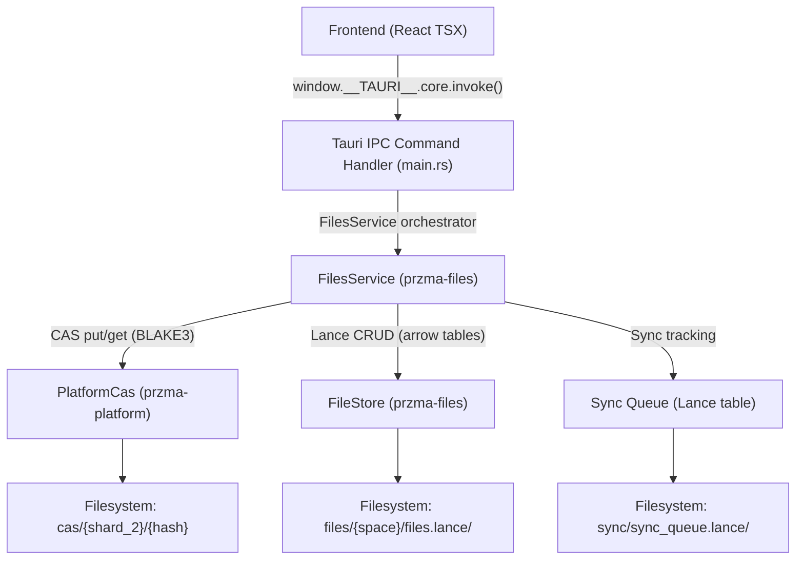

# PRZMA Local File System — Complete Flow & Schema Documentation

This document describes the end-to-end data flow and database schemas of the PRZMA local file storage system, detailing how files move from the React/Tauri UI frontend to the local Rust service, content-addressable storage (CAS), LanceDB tables, and sync queue.

---

## 1. System Architecture (Bird's Eye Flow)



---

## 2. End-to-End System Flow Walkthrough

### 2.1 Layer 1: Frontend (React TSX)
* **File Location**: [App.tsx](file:///d:/przma_code/przma/przma-platform-complete/przma-files-desktop/ui/App.tsx)
* **Operation**:
  1. The user drags a file into the upload dropzone or browses their filesystem.
  2. The frontend reads the file as an `ArrayBuffer` in Javascript.
  3. The buffer is converted into a `Uint8Array` and encoded chunk-by-chunk (in 8KB segments to avoid call-stack overflow) into a **base64 string**.
  4. The Tauri IPC bridge invokes the Rust Tauri command:
     ```typescript
     window.__TAURI__.core.invoke('upload_file', {
       fileName: file.name,
       filePath: '/',
       space: space, // e.g. "core", "commons", "circle:did:web:..."
       mimeType: file.type || 'application/octet-stream',
       content: base64_content, // base64 string
     });
     ```

### 2.2 Layer 2: Tauri IPC Bridge & Rust Commands
* **File Location**: [main.rs](file:///d:/przma_code/przma/przma-platform-complete/przma-files-desktop/src/main.rs)
* **Operation**:
  1. The Tauri runtime catches the `upload_file` command.
  2. The handler decodes the base64 string back into raw bytes (`Vec<u8>`).
  3. It parses the space string into a typed `Space` enum (`Core` for personal files, `Commons` for public files, or `Circle(did)` for shared circle files).
  4. It calls `FilesService::add_file()` with the raw parameters.

### 2.3 Layer 3: Orchestrator (`FilesService`)
* **File Location**: [store.rs](file:///d:/przma_code/przma/przma-platform-complete/przma-vault/przma-files/src/store.rs)
* **Operation**:
  `FilesService` orchestrates writing file bytes to disk and writing metadata to databases:
  1. **Write to CAS**: Calls `PlatformCas::put()` to write raw bytes to the sharded CAS repository. CAS cryptographically hashes the file with BLAKE3. If the hash exists, reference counts are updated. If the hash is new, the raw bytes and a `.meta.json` sidecar are written.
  2. **Build FileRecord**: Creates a `FileRecord` struct containing a generated UUID, space mapping, MIME type, file size, timestamps, the CAS URI (`cas:{blake3_hash}`), and sets `synced: false`.
  3. **Write to LanceDB**: Calls `FileStore::create()` which converts the `FileRecord` into an Arrow `RecordBatch` and adds it to the LanceDB table corresponding to the active user DID and space directory.

### 2.4 Layer 4: Content-Addressable Storage (CAS)
* **File Location**: [cas.rs](file:///d:/przma_code/przma/przma-platform-complete/przma-vault/przma-platform/src/cas.rs)
* **Operation**:
  * Dedupes all data in a single user vault. Identical files written by different subsystems (files, calendar, chat) share the same physical storage.
  * Files are stored under a sharded directory layout based on the first 2 characters of their 64-char BLAKE3 hash:
    `{base_path}/{did}/cas/{shard_2}/{hash_64}`
  * A sidecar file containing metadata (`{hash_64}.meta.json`) is maintained to track reference counts (`ref_count`) to support clean deletions.

### 2.5 Layer 5: LanceDB columnar database
* **File Location**: [store.rs](file:///d:/przma_code/przma/przma-platform-complete/przma-vault/przma-files/src/store.rs)
* **Operation**:
  * LanceDB stores file metadata in Arrow format, providing high-performance query execution and native support for 768-dimensional vector embeddings (used for semantic file searches).
  * Storage path maps to `{base_path}/{did}/files/{space}/files.lance/`.

### 2.6 Layer 6: Sync Queue
* **File Location**: [schema.rs](file:///d:/przma_code/przma/przma-platform-complete/przma-vault/przma-files/src/schema.rs)
* **Operation**:
  * Any files added to **Commons** or **Circle** spaces are marked with `synced = false`.
  * The background sync worker fetches these records from LanceDB, uploads their CAS blobs to the remote backend server CAS, updates the remote LanceDB, and then marks the local records as `synced = true`.

---

## 3. Database Tables & Schemas

### 3.1 LanceDB File Metadata Table Schema (`local_file_schema`)
* **Physical DB Path**: `{base_path}/{did}/files/{space}/files.lance/`

| # | Field Name | Arrow Data Type | Nullable | Description |
|---|------------|-----------------|:--------:|-------------|
| 1 | `id` | `Utf8` | ❌ No | Unique UUID (v4) identifying the file record |
| 2 | `did` | `Utf8` | ❌ No | Owner's Decentralized Identifier (DID) |
| 3 | `space` | `Utf8` | ❌ No | Target space: `"core"`, `"commons"`, or `"circle:{did}"` |
| 4 | `name` | `Utf8` | ❌ No | The original name of the file (e.g. `photo.png`) |
| 5 | `path` | `Utf8` | ❌ No | Virtual directory path inside the space (e.g. `/`, `/documents`) |
| 6 | `mime_type` | `Utf8` | ❌ No | Standard MIME type (e.g. `image/png`, `application/pdf`) |
| 7 | `size_bytes` | `Int64` | ❌ No | Total file size in bytes |
| 8 | `content_cas` | `Utf8` | ❌ No | Reference to content blob in CAS: `cas:{blake3_hash}` |
| 9 | `thumbnail_cas` | `Utf8` |  Yes | Optional reference to generated thumbnail in CAS |
| 10 | `versions_json` | `Utf8` | ❌ No | JSON array tracking file version history and edits |
| 11 | `current_version` | `Int32` | ❌ No | Current version number of the file (starts at `1`) |
| 12 | `tags_json` | `Utf8` | ❌ No | JSON array representing tags (e.g. `["work", "tax"]`) |
| 13 | `source_uri` | `Utf8` |  Yes | Optional origin URI if this file came from a remote source |
| 14 | `embedding` | `FixedSizeList(Float32, 768)` | ❌ No | 768-dimensional float vector for semantic search |
| 15 | `is_public` | `Boolean` | ❌ No | Flag set to `true` if files are in the Commons space |
| 16 | `is_encrypted` | `Boolean` | ❌ No | Flag specifying if the CAS blob is encrypted |
| 17 | `upload_status` | `Utf8` | ❌ No | Status: `"pending"`, `"chunking"`, `"complete"`, `"failed"` |
| 18 | `chunk_count` | `Int32` |  Yes | Number of chunks for chunked transfers |
| 19 | `chunks_received` | `Int32` |  Yes | Counts received chunks |
| 20 | `created_at` | `Int64` | ❌ No | Timestamp in microseconds UTC |
| 21 | `updated_at` | `Int64` | ❌ No | Timestamp in microseconds UTC |
| 22 | `synced` | `Boolean` | ❌ No | Sync status tracking: `true` if synced to remote, `false` otherwise |

---

### 3.2 Sync Queue Table Schema (`sync_queue_schema`)
* **Physical DB Path**: `{base_path}/{did}/files/sync/sync_queue.lance/`

| # | Field Name | Arrow Data Type | Nullable | Description |
|---|------------|-----------------|:--------:|-------------|
| 1 | `id` | `Utf8` | ❌ No | Unique UUID (v4) for the sync queue transaction |
| 2 | `did` | `Utf8` | ❌ No | Owner's DID |
| 3 | `file_id` | `Utf8` | ❌ No | Target file ID matching `id` in the File Metadata table |
| 4 | `file_name` | `Utf8` | ❌ No | Name of the file being synced |
| 5 | `przma_uri` | `Utf8` | ❌ No | Canonical platform URI (`przma://{did}/files/{space}/file/{id}`) |
| 6 | `space` | `Utf8` | ❌ No | Target space for sync (`"commons"` or `"circle:{did}"`) |
| 7 | `sync_mode` | `Utf8` | ❌ No | Sync privacy level: `"public"` or `"shared"` |
| 8 | `mime_type` | `Utf8` | ❌ No | File mime type |
| 9 | `file_size` | `Int64` | ❌ No | Size of the file in bytes |
| 10 | `content_cas` | `Utf8` | ❌ No | The content CAS URI to sync |
| 11 | `status` | `Utf8` | ❌ No | Queue state: `"pending"`, `"uploading"`, `"synced"`, or `"failed"` |
| 12 | `enqueued_at` | `Int64` | ❌ No | Timestamp when added to the sync queue (microseconds UTC) |
| 13 | `synced_at` | `Int64` |  Yes | Timestamp when sync completed (microseconds UTC) |
| 14 | `retry_count` | `Int32` | ❌ No | Number of failed sync attempts (increments on retry) |
| 15 | `error_msg` | `Utf8` |  Yes | Optional error message if the last sync attempt failed |

---

### 3.3 CAS Entry Metadata Sidecar Schema (`CasEntry`)
* **Physical File Path**: `{base_path}/{did}/cas/{shard_2}/{hash}.meta.json`

| Property | JSON Data Type | Description |
|----------|----------------|-------------|
| `hash` | `String` | 64-character hex encoded BLAKE3 hash (acting as primary key) |
| `size_bytes` | `Number (u64)` | Total size of the blob on disk in bytes |
| `mime_type` | `String / null` | Optional standard MIME type of the file |
| `created_at` | `Number (i64)` | Timestamp when the blob was written (Unix microseconds UTC) |
| `created_by` | `String` | Subsystem namespace that wrote the file (e.g. `"files"`, `"calendar"`) |
| `ref_count` | `Number (u32)` | Reference count. Increments on duplicate writes, decrements on delete. |
| `is_encrypted` | `Boolean` | Flag showing whether the blob is encrypted on disk |
